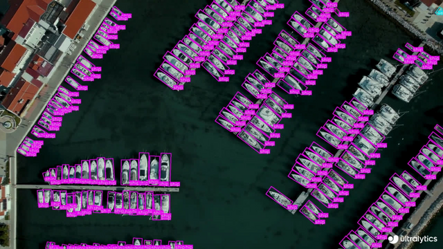

# obb 是什么

日期: 周三- 2024-02-14 05:46:55

作者: 范仁义

---

🍉

# Oriented Bounding Boxes Object Detection

OBB 定向边界框

🍇

🍋

🍅

🍐

📖

🍧

Oriented Bounding Boxes (OBB 定向边界框) Object Detection 是计算机视觉中的一项技术，用于在图像或视频中检测并定位对象。与传统的轴对齐边界框（Axis-Aligned Bounding Boxes, AABB）不同，OBB 可以围绕对象的实际方向进行旋转，更准确地适应对象的形状。

### AABB vs OBB：

- **轴对齐边界框（AABB）**：通常是矩形框，其边与图像的 x 轴和 y 轴平行。这种方法简单快速，但当对象倾斜或旋转时，AABB 可能会包含很多背景信息，这并不利于精确检测。
- **定向边界框（OBB）**：是可以自由旋转的矩形框，其边与对象的主轴对齐，而不是与图像轴对齐。OBB 更紧密地围绕对象，减少了包含无关背景的可能性，提供了更精确的对象定位。

### OBB Object Detection 的工作流程：

1. **对象检测**：首先，系统会使用对象检测算法（如 CNN, YOLO, SSD 等）在图像中识别出潜在的对象。
2. **定向边界框生成**：对于检测到的每个对象，算法会计算其最佳拟合的 OBB。这通常涉及到找出对象的主方向，并围绕该方向生成最小面积的矩形框。
3. **角度预测**：在某些情况下，OBB 检测系统还会预测边界框的旋转角度。
4. **非极大抑制（NMS）**：由于同一个对象可能被检测多次，NMS 用于消除重复的检测结果，确保每个对象只有一个边界框。

### 应用：

OBB 检测在需要准确定位和描述对象形状和姿态的场景下特别有用。例如，在遥感图像分析中，船只和飞机等对象往往是倾斜的，使用 OBB 可以更好地描述它们。在工业检测、机器人视觉以及增强现实（AR）等领域，OBB 也有广泛应用。

### 结论：

OBB Object Detection 提供了一种比传统 AABB 更加精确的对象检测和定位方法。它通过适应对象的实际方向来提高检测的精度，尤其在处理旋转或非水平放置的对象时更为有效。然而，计算 OBB 相对于 AABB 更复杂，可能需要更多的计算资源和更高级的算法。

🍓

📒

🔧

🌱

🌺

🔥

✨

🍹

🧊

🍄

🌷

💮

🌸

🍁

🌳

🌲

🌴

🍎

🍓

🍊

🍒

🍌

🍑

🍍

🍉

🍇

🍋

🍅

🍐

📖

🍧

🍓

📒

🔧

🌱

🌺

🔥

✨

🍹

🧊

🍄

🌷

💮

🌸

🍁

🌳

🌲

🌴
